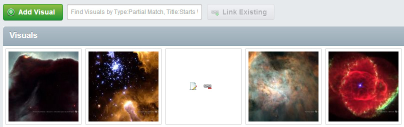

GridField Gallery Theme
============================
SS3 GridField component that attempt to change the GridField layout into an basic gallery view. (Still in dev)



## About
* Display gridfield item as thumbnails for Image has_one relations
* Displays file type icons for File has_one relations (sample icons by [filetypeicons.com](http://filetypeicons.com)
* Action button accessible on mouseover
* Great with [GridFieldBulkEditingTools](https://github.com/colymba/GridFieldBulkEditingTools)
* Works with [SortableGridField](https://github.com/UndefinedOffset/SortableGridField)

## Usage
Add component like this:
````php
$config->addComponent(new GridFieldGalleryTheme('HasOneRelation'));
````
with the string 'HasOneRelation' being the name of the has_one Image/File relation in your DataObject that your want to use as thumbnail/icon preview.

### File type icons
File type icons are stored in the component's folder under img/icons/ saved as PNG and name with the extension of the file type (i.e. pdf.png)
Although, if no icon file is found for the specific extension, the extension is looked up in $fileTypeMapping to find a suitable icon.

## NOTES
* Tested in Chrome, Safari, FireFox, Opera and IE9
* GridFieldSortableHeader is removed since this causes problem with the layout (at least for now)

## @TODO
* Add functionality to display a Name/Title on mouseover
* Option for dynamic thumbnail resizing in the view
* other stuff...

## License (BSD Simplified)

Copyright (c) 2013, Thierry Francois (colymba)

All rights reserved.

Redistribution and use in source and binary forms, with or without modification, are permitted provided that the following conditions are met:

 * Redistributions of source code must retain the above copyright notice, this list of conditions and the following disclaimer.
 * Redistributions in binary form must reproduce the above copyright notice, this list of conditions and the following disclaimer in the documentation and/or other materials provided with the distribution.
 * Neither the name of Thierry Francois, colymba nor the names of its contributors may be used to endorse or promote products derived from this software without specific prior written permission.
 
THIS SOFTWARE IS PROVIDED BY THE COPYRIGHT HOLDERS AND CONTRIBUTORS "AS IS" AND ANY EXPRESS OR IMPLIED WARRANTIES, INCLUDING, BUT NOT LIMITED TO, THE IMPLIED WARRANTIES OF MERCHANTABILITY AND FITNESS FOR A PARTICULAR PURPOSE ARE DISCLAIMED. IN NO EVENT SHALL THE COPYRIGHT HOLDER OR CONTRIBUTORS BE LIABLE FOR ANY DIRECT, INDIRECT, INCIDENTAL, SPECIAL, EXEMPLARY, OR CONSEQUENTIAL DAMAGES (INCLUDING, BUT NOT LIMITED TO, PROCUREMENT OF SUBSTITUTE GOODS OR SERVICES; LOSS OF USE, DATA, OR PROFITS; OR BUSINESS INTERRUPTION) HOWEVER CAUSED AND ON ANY THEORY OF LIABILITY, WHETHER IN CONTRACT, STRICT LIABILITY, OR TORT (INCLUDING NEGLIGENCE OR OTHERWISE) ARISING IN ANY WAY OUT OF THE USE OF THIS SOFTWARE, EVEN IF ADVISED OF THE POSSIBILITY OF SUCH DAMAGE.